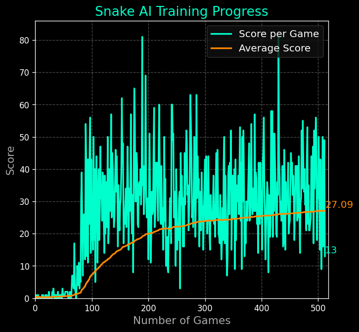

# Snake AI with Deep Q-Learning

This project implements a classic **Snake game** in Python using `pygame` and trains an AI agent to play it using **Deep Q-Learning (DQN)** with `PyTorch`.

The agent learns to play Snake by trial and error:
- Observing the game state  
- Choosing an action (move up, down, left, right)  
- Receiving a reward (+1 for eating food, -10 for dying, small penalty otherwise)  
- Updating its neural network to maximize long-term score  

---

## 🐍 Project Structure
├── agent.py # AI agent logic (DQN, training loop, memory replay)

├── model.py # Neural network (Q-network) + trainer

├── snake_game.py # Game environment built with pygame

├── helper.py # Plotting utilities for training progress

├── README.md # Project documentation

## 🖼️ Screenshot

